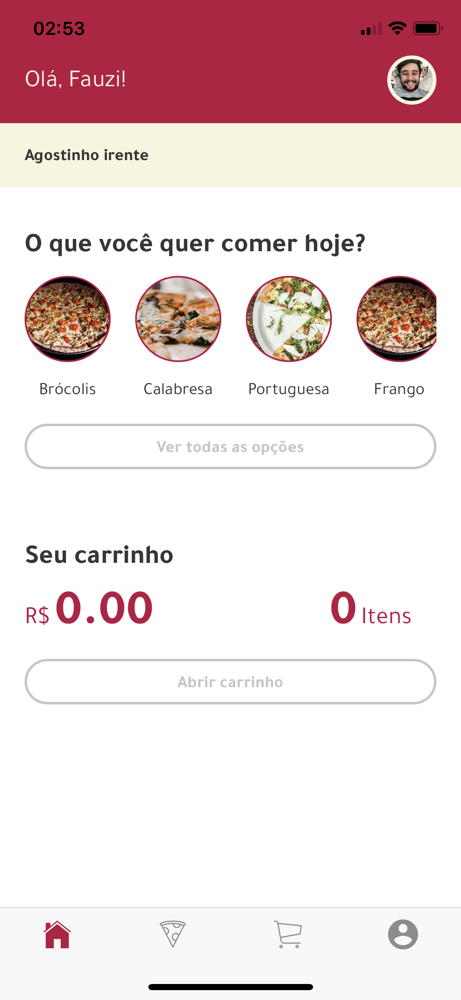
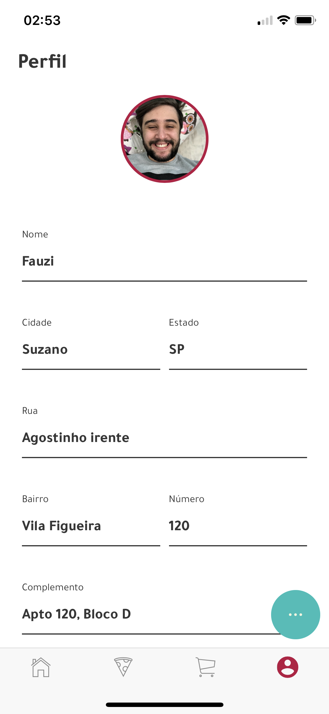

# 🍕 Pizza App

Este é um aplicativo de pedidos de pizza desenvolvido com Ionic 3, que oferece uma interface intuitiva para personalização de pizzas e gerenciamento de pedidos.

## 🚀 Funcionalidades

- 🛒 **Carrinho de compras**
- 🍕 **Personalização de pizzas**
- 👤 **Perfil de usuário**

## 📸 Capturas de Tela

<p align="center">
  
  
  
  
</p>

## 🛠️ Tecnologias Utilizadas

- **Ionic 3**
- **Angular 5**
- **Firebase**
- **Cordova Plugins**

## 📋 Instalação

Siga os passos abaixo para rodar o aplicativo localmente:

1. Clone o repositório:
   ```bash
   git clone https://github.com/fauzihalabe/ionic-3-pizza-app.git

2. Instale as dependências:
   ```bash
   npm install

3. Execute o aplicativo:
   ```bash
   ionic serve

## 🤝 Contribuições

Contribuições são bem-vindas! Abra uma issue ou envie um pull request.


